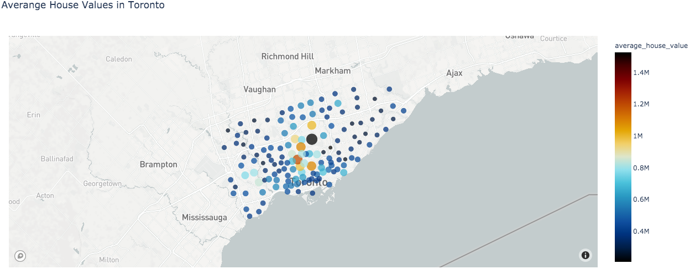

# Pythonic Monopoly
-----------------------------------------
By Nedal Mahanhwe 


## Description 

The goal of this project  is to provide charts, maps, and interactive visualizations that help customers explore the data and determine if they want to invest in rental properties in Toronto.


   
   ` Files ` 
   
   *  A notebook of rental analysis that contains all the code have been used. [rental_analysis](rental_analysis)

   
   ### Dwelling Types Per Year 

 we calculated  the number of dwelling types per year and Visualized  the results using **bar charts**  and the Pandas **plot function**.
 
 
 
 | |

 | 


## Average Monthly Shelter Costs in Toronto Per Year


To understand rental income trends over time better,we visualized the average (mean) shelter cost for owned and rented dwellings per year and visualize it as **line charts**

 


## Average House Value per Year

This section will be helpfull for customer who have adoubt about if they  should expect an increase or decrease in the property value over time so they can determine how long to hold the rental property

 we calculated and visualized  the average_house_value per year as a ```line chart```.


## Average House Value by Neighbourhood

we  used  ```hvplot```  to create an interactive visualization of the **average house value** with a dropdown selector for the neighbourhood.
using `hvplot.line () & Groupby`

  


  


## Number of Dwelling Types per Year

this section will  provide investors a tool to understand the evolution of dwelling types over the years.
we  visualized the number of dwelling types per year in each neighbourhood using `hvplot.bar()`

||
|


## Top 10 Most Expensive Neighbourhoods
In this section, we wanted to figure out which neighbourhoods are the most expensive. 

we calculated the mean house value for each neighbourhood and then sorted the values using ``sort_value`` to obtain the top 10 most expensive neighbourhoods using `nlargest()`  on average and  Plotted  the results as a **bar chart** using `hvplot.bar( )`


## Neighbourhood Map

 reading in neighbourhood location data and building  an interactive map with the average prices per neighbourhood, Using a `scatter Mapbox object` from Plotly express to create the visualization

 **note**   this part required using my Mapbox API KEY


 


## Cost Analysis (Optional Challenge)
this part is using Plotly express to create a couple of plots that investors can interactively filter and explore various factors related to the house value of Toronto's neighbourhoods.


 
 
 


# Created a sunburst chart to conduct a cost analysis of the most expensive neighbourhoods in Toronto per year.
|


## Sample Dashboard

provide charts, maps, and interactive visualizations that help customers explore the data and determine if they want to invest in rental properties in Toronto.
 


